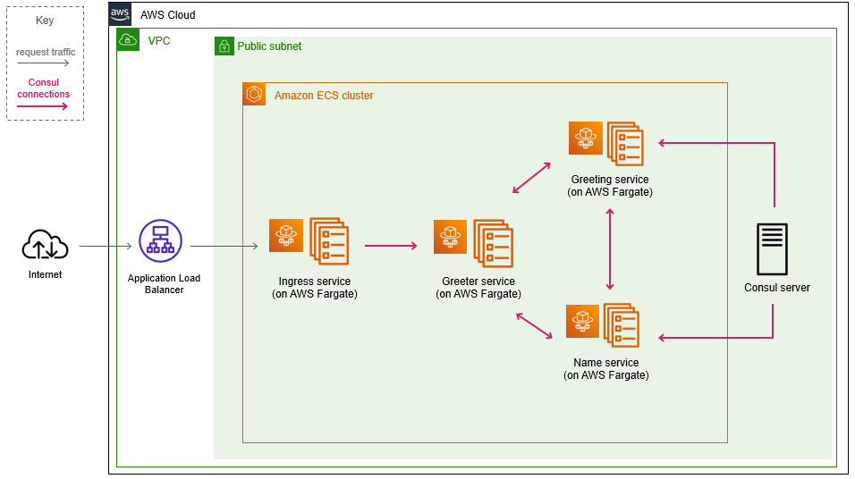
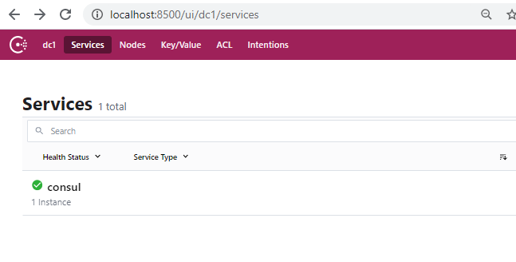
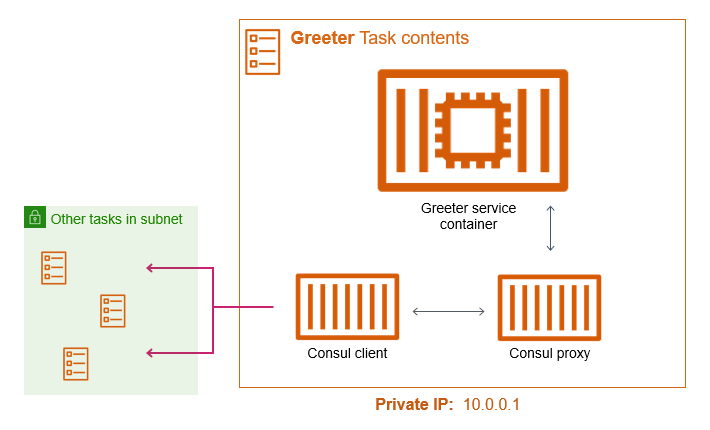
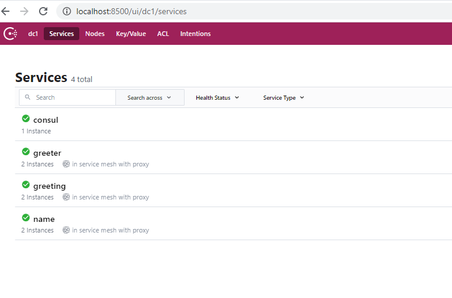
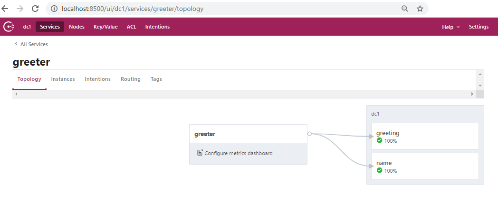
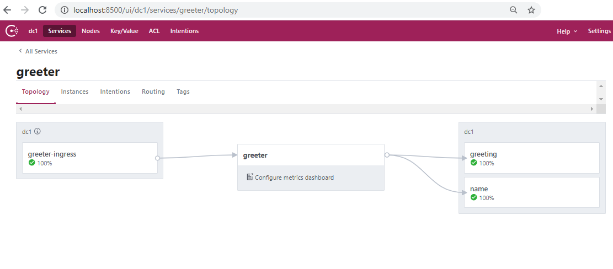

# Example: Amazon ECS on AWS Fargate with Consul Connect service mesh

In this example we'll configure several Amazon ECS container services running on AWS Fargate to join and communicate via a [Consul Connect service mesh](https://www.consul.io/) with a control plane hosted in Amazon EC2.


## Architecture
At the end of this demo you should have an architecture which resembles the following:




## Requirements:
* Docker on your local machine
* The AWS CLI with valid AWS account credentials configured
* The [`AWSServiceRoleForECS`](https://docs.aws.amazon.com/AmazonECS/latest/developerguide/using-service-linked-roles.html) should exist in your account. If it does not exist, you can create it with the following AWS CLI command:
```
aws iam create-service-linked-role --aws-service-name ecs.amazonaws.com
```


## Create the VPC and Amazon ECS Cluster

First we're going to create a VPC to house our mesh and an Amazon ECS cluster for our container services. This stack will also create several Amazon ECR repositories for the service images we'll be building. 
```
aws cloudformation deploy --template-file .\cluster-fargate-consul-connect.yml --stack-name ConsulEcsCluster --region $AWS_REGION
```


## Deploy the Consul Connect server

Now we're going to deploy a Consul connect server that our container services can join. In production, you would want to have an odd number of redundant server instances running in order to provide more robust and resilient consensus, but one server will work for this example.
* NOTE: Make sure to select a valid key pair so you can SSH into the server instance and view the Consul UI.
```
aws cloudformation deploy --template-file .\mesh-consul-connect.yml --stack-name ConsulMeshStack --parameter-overrides KeyName=$MY_SSH_KEY --region $AWS_REGION
```

When stack creation completes, you should be able to SSH into your Consul server instance and access the Consul UI. The SSH command you need to execute in order to set up port forwarding to view the Consul dashboard **will be in the stack output** and should look something like:
```bash
# example of an output SSH command
ssh -i "~/.ssh/MY_SSH_KEY.pem" -L 127.0.0.1:8500:ec2-0-96-158-00.eu-west-1.compute.amazonaws.com:8500 ec2-user@ec2-0-96-158-00.eu-west-1.compute.amazonaws.com
```


Navigte to `localhost:8500` in your browser and view the Consul UI, which should contain one service named `consul`:




## Launch AWS Fargate services into your Amazon ECS cluster

Now we're ready to launch Amazon ECS services which will join the service mesh! But first let's look at the makeup of the services we're about to create:



Each service task will be composed of 3 containers:

* The service container itself
* The Consul client container, which generates the Consul client config and service definition before starting the Consul client.
* The Consul Connect proxy which handles communcation between the service container and the local Consul client.


### Build and push the "client" containers to Amazon ECR

From within the root of this repository, run the following commands to build the test service containers:

```
docker build -f services/greeting/src/Dockerfile -t greeting services/greeting/src
docker build -f services/name/src/Dockerfile -t name services/name/src
docker build -f services/greeter/src/Dockerfile -t greeter services/greeter/src
```

Then login to Amazon ECR so you can push your images. Make sure to use your AWS account ID and the specific region where you have been deploying the other components of the service mesh.

```
aws ecr get-login-password --region $AWS_REGION | docker login --username AWS --password-stdin $AWS_ACCOUNT_ID.dkr.ecr.$AWS_REGION.amazonaws.com
```

Now you can tag and push the service images:

```bash
# save ECR registry URI to an environment variable so we can reuse it
ECR_URI=$AWS_ACCOUNT_ID.dkr.ecr.$AWS_REGION.amazonaws.com

# tag and push the greeting service image
docker tag greeting:latest $ECR_URI/greeting:latest
docker push $ECR_URI/greeting:latest

# tag and push the name service image
docker tag name:latest $ECR_URI/name:latest
docker push $ECR_URI/name:latest

# tag and push the greeter service image
docker tag greeter:latest $ECR_URI/greeter:latest
docker push $ECR_URI/greeter:latest
```

Now build and push the Consul client containers for each service the same way. 
* NOTE: The client containers consistent of a Consul base image with some service-specific configuration baked in. You could also try to configure the agent with command line arguements or with files pulled from S3 or EFS, but generating the config with a script baked into the client is easier to debug via logs and will suffice for this example.

```bash
# build, tag, and push greeting client image
docker build -f services/greeting/client/Dockerfile -t greeting-client services/greeting/client
docker tag greeting-client:latest $ECR_URI/greeting-client:latest
docker push $ECR_URI/greeting-client:latest

# build, tag, and push name client image
docker build -f services/name/client/Dockerfile -t name-client services/name/client
docker tag name-client:latest $ECR_URI/name-client:latest
docker push $ECR_URI/name-client:latest

# build, tag, and push greeter client image
docker build -f services/greeter/client/Dockerfile -t greeter-client services/greeter/client
docker tag greeter-client:latest $ECR_URI/greeter-client:latest
docker push $ECR_URI/greeter-client:latest
```


### Create the Amazon ECS services

Now that the service and client container images are in Aamzon ECS, we can create the Amazon ECS services:

```
# deploy the "greeting" service
aws cloudformation deploy --template-file .\services\greeting\service-consul-connect-greeting-fargate.yml --stack-name ConsulGreetingService --parameter-overrides ImageUrl=$ECR_URI/greeting InitImageUrl=$ECR_URI/greeting-client --capabilities CAPABILITY_IAM --region $AWS_REGION

# deploy the "name" service
aws cloudformation deploy --template-file .\services\name\service-consul-connect-name-fargate.yml --stack-name ConsulNameService --parameter-overrides ImageUrl=$ECR_URI/name InitImageUrl=$ECR_URI/name-client --capabilities CAPABILITY_IAM --region $AWS_REGION

# deploy the "greeter" service
aws cloudformation deploy --template-file .\services\greeter\service-consul-connect-greeter-fargate.yml --stack-name ConsulGreeterService --parameter-overrides ImageUrl=$ECR_URI/greeter InitImageUrl=$ECR_URI/greeter-client --capabilities CAPABILITY_IAM --region $AWS_REGION
```


After the services are done deploying you should be able to see them in your Consul UI at `http://localhost:8500/ui/dc1/services`:



Click on the `greeter` service to view the topology of its connections to other services. We can see that its configured to communicate with the upstream `name` and `greeting` services.



Now let's test the connectivity between the services by hitting the `greeter` endpoint. In the same SSH session we opened to the Consul server, enter the following commands:
```bash
# install the Consul binary
sudo yum install -y wget unzip
wget https://releases.hashicorp.com/consul/1.9.1/consul_1.9.1_linux_amd64.zip
unzip consul_1.9.1_linux_amd64.zip

# start the test proxy
./consul connect proxy -service test -upstream greeter:8080 &

# curl the greeter endpoint
curl localhost:8080

# response should display a random greeting to a random name, with source IPs
From ip-10-0-1-64.eu-west-1.compute.internal: Greetings (ip-10-0-0-244.eu-west-1.compute.internal) Jennifer (ip-10-0-1-44.eu-west-1.compute.internal)
```

## Deploy the Ingress service + Load Balancer

To expose the `greeter` service to the internet, we'll create an `nginx` service with a Consul client which will to proxy requests to it via the mesh, and put that service behind an Application Load Balancer. 

Build and push the ingress-init container
```bash
docker build -f services/ingress/client/Dockerfile -t ingress-client services/ingress/client
docker tag ingress-client:latest $ECR_URI/ingress-client:latest
docker push $ECR_URI/ingress-client:latest
```

Deploy the service and ALB
```
aws cloudformation deploy --template-file .\services\ingress\ingress-consul-connect-fargate.yml --stack-name ConsulIngress --parameter-overrides InitImageUrl=$ECR_URI/ingress-client --capabilities CAPABILITY_IAM --region $AWS_REGION
```

When the stack is complete, the external URL of the ALB will appear as the stack output `ExternalUrl` - curl this endpoint and you should see a response from your service(s) in the mesh.
```
curl http://consu-publi-aaauv3we8kbg-87191928.ca-central-1.elb.amazonaws.com/

# response
From ip-10-0-0-87.ca-central-1.compute.internal: Hello (ip-10-0-0-176.ca-central-1.compute.internal) Barbara (ip-10-0-1-203.ca-central-1.compute.internal)
```

Navigating to the `greeter` service topology in the Consul UI should now show the `greeter-ingress` service as a downstream connection:




## Cleanup

To clean up the resources created for this setup, simply delete the CloudFormation stacks in reverse order:
```bash
# delete ingress stack
aws cloudformation delete-stack --stack-name ConsulIngress --region $AWS_REGION

# delete service stack
aws cloudformation delete-stack --stack-name ConsulGreeterService --region $AWS_REGION
aws cloudformation delete-stack --stack-name ConsulGreetingService --region $AWS_REGION
aws cloudformation delete-stack --stack-name ConsulNameService --region $AWS_REGION

# delete mesh stack
aws cloudformation delete-stack --stack-name ConsulMeshStack --region $AWS_REGION

# delete VPC & cluster stack
# WARNING: you will need to delete the images within each ECR repositories before this stack will fully delete
aws cloudformation delete-stack --stack-name ConsulEcsCluster --region $AWS_REGION
```


## Limitations of this setup

The above architecture lacks some features customers may require for their own service mesh environments.

### Lack of Access Control Lists (ACL)
As configured, this mesh does not use [Consul ACL](https://www.consul.io/docs/security/acl), which is recommended for production workloads. Enabling ACL requires generating the required secrets and adding them to your Amazon ECS task definition(s) so the Consul client can use them to authenticate.

### Use of the Consul built in proxy
This example uses Consul's built-in proxy, but most customers will want to use an [`Envoy`](https://www.consul.io/docs/connect/proxies/envoy) proxy to leverage layer 7 routing features for tasks like A/B tests or canary deployments. One way do to this would be to use an `Envoy` image in the proxy container of the service and pass it a bootstrap file on startup which was generated by the local Consul client. 


## Security

See [CONTRIBUTING](CONTRIBUTING.md#security-issue-notifications) for more information.

## License

This library is licensed under the MIT-0 License. See the LICENSE file.