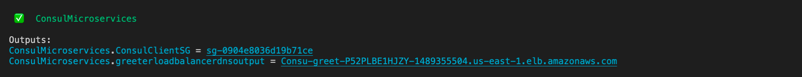

# Example CDK implementation - Amazon ECS on AWS Fargate with Consul Connect service mesh

In this example we'll configure one Consul server in VPC with TLS and gossip encryption enabled. Using AWS CDK, we'll create and deploy the application stack that will launch ECS cluster with sample `greeter` application connected to Consul service mesh.

## Requirements:
* AWS CLI with valid AWS account credentials configured

## Step 1 - Create the VPC and Consul server

First we're going to create a VPC and Consul server. This stack will automatically configure Consul with TLS and gossip encryption. There will be two AWS Secrets Manager secrets created after successful deployment. Change the `$AWS_REGION` and `$MY_PUBLIC_IP` with your target region and your public IP accordingly. You need to have EC2 key pair in the target region, change `$MY_KEN_NAME` with your EC2 key pair name.

```
aws cloudformation deploy --template-file ./template/consul-server-tls-gossip.yaml --stack-name ConsulServer --region $AWS_REGION --capabilities CAPABILITY_IAM --parameter-overrides AllowedIP=$MY_PUBLIC_IP KeyName=$MY_KEY_NAME
```
Once it's deployed, take note of the following from the output:
* VPC id of the new VPC created by the CloudFormation stack
* Security group id of the Consul server
* ARN of the two AWS Secrets Manager secrets for Agent CA and Gossip. Use AWS console / CLI, this output is not visible on the CloudFormation stack.

You can use the string `ConsulSshTunnel` from the CloudFormation output to create SSH tunnel to the Consul server and then access it's UI from http://localhost:8500/ui/

## Step 2 - Create the sample CDK application

### Pre-requisites
* We highly recommend to use an IDE that supports code-completion and syntax highlighting, i.e. VSCode, AWS Cloud9, Atom, etc.
* AWS CDK Toolkit `npm install -g aws-cdk`
* AWS CLI with valid AWS account credentials configured

### Create project directory
Create an empty directory on your system, initialize Typescript CDK project and install NPM packages.

```
mkdir app1
cd app1
cdk init --language typescript
npm install @aws-cdk/core @aws-cdk/aws-ec2 @aws-cdk/aws-ecs @aws-cdk/aws-secretsmanager @aws-cdk-containers/ecs-service-extensions @aws-quickstart/ecs-consul-mesh-extension
npm update
```

### Update app entry point 
Edit your `bin/app1.ts` file by specifying the target AWS account id and the region. Update `$AWS_ACCOUNT_ID` and `$AWS_REGION` to match your target account and region.

```
#!/usr/bin/env node
import 'source-map-support/register';
import * as cdk from '@aws-cdk/core';
import { App1Stack } from '../lib/app1-stack';

const env = { account: '$AWS_ACCOUNT_ID', region: '$AWS_REGION' };

const app = new cdk.App();
new App1Stack(app, 'App1Stack', {env: env});
```

### Add extension to your stack
Edit your stack `lib/app1-stack.ts`. First replace the `$MY_VPC_ID` and `$AWS_REGION` with the VPC id and the region from the CloudFormation stack that you deployed on step-1 earlier. Next you need to replace the `$CONSUL_SG` with the Consul server security group from step-1.


```
import * as cdk from '@aws-cdk/core';
import * as ec2 from '@aws-cdk/aws-ec2';
import * as ecs from '@aws-cdk/aws-ecs';
import * as secretsmanager from '@aws-cdk/aws-secretsmanager';
import { AssignPublicIpExtension, Container, Environment, Service, ServiceDescription, HttpLoadBalancerExtension } from '@aws-cdk-containers/ecs-service-extensions';
import { ECSConsulMeshExtension, RetryJoin } from '@aws-quickstart/ecs-consul-mesh-extension';

export class App1Stack extends cdk.Stack {
  constructor(scope: cdk.Construct, id: string, props?: cdk.StackProps) {
    super(scope, id, props);

    //change with your vpc id
    const vpc = ec2.Vpc.fromLookup(this, 'consulVPC', { vpcId: '$MY_VPC_ID', region: '$AWS_REGION' })

    const environment = new Environment(this, 'demo', {
      vpc: vpc
    });

    //change to your security group id    
    const consulServerSecurityGroup = ec2.SecurityGroup.fromLookup(this, 'consulServerSecurityGroup', '$CONSUL_SG')
 
    const consulClientSecurityGroup = new ec2.SecurityGroup(this, 'consulClientSecurityGroup', {
      vpc: environment.vpc
    });
    
    consulClientSecurityGroup.addIngressRule(
      consulClientSecurityGroup,
      ec2.Port.tcp(8301),
      "allow all the clients in the mesh talk to each other"
    );

    consulClientSecurityGroup.addIngressRule(
      consulClientSecurityGroup,
      ec2.Port.udp(8301),
      "allow all the clients in the mesh talk to each other"
    );
  }
}
```

Continue to open `lib/app1-stack.ts`, configure the reference to agent CA and gossip encryption. Replace `$CONSUL_AGENT_CA` with the ARN of Secrets Manager Agent CA. Replace `$CONSUL_GOSSIP` with the ARN of Secrets Manager Agent Gossip.

```
export class App1Stack extends cdk.Stack {
  constructor(scope: cdk.Construct, id: string, props?: cdk.StackProps) {
    super(scope, id, props);

    // continue from previous example ...
    
    // change to your secrets manager ARN
    const agentCASecret = secretsmanager.Secret.fromSecretAttributes(this, 'ImportedSecret', {
      secretArn: '$CONSUL_AGENT_CA'
    });
 
    const gossipSecret = secretsmanager.Secret.fromSecretAttributes(this, 'ImportedGossipSecret', {
      secretArn: '$CONSUL_GOSSIP',
    });
  }
}
```

Next, declare the first service called `name`. Replace the `$AWS_REGION` with your target region. The RetryJoin uses tag Name = test-consul-server, which matches with the Consul server tags. Replace this if you are using different Consul server.

```
export class App1Stack extends cdk.Stack {
  constructor(scope: cdk.Construct, id: string, props?: cdk.StackProps) {
    super(scope, id, props);

    // continue from previous example ...

    // NAME service
    const nameDescription = new ServiceDescription();
    nameDescription.add(new Container({
      cpu: 1024,
      memoryMiB: 2048,
      trafficPort: 3000,
      image: ecs.ContainerImage.fromRegistry('nathanpeck/name')
    }));
 
    nameDescription.add(new ECSConsulMeshExtension({      
      retryJoin: new RetryJoin({ region: '$AWS_REGION', tagName: 'Name', tagValue: 'test-consul-server' }),
      port: 3000,
      consulClientSecurityGroup: consulClientSecurityGroup,
      consulServerSecurityGroup: consulServerSecurityGroup,
      consulCACert: agentCASecret,
      gossipEncryptKey: gossipSecret,
      tls: true,
      serviceDiscoveryName: 'name',
      consulDatacenter: 'dc1',
    }));

    nameDescription.add(new AssignPublicIpExtension());
    
    const name = new Service(this, 'name', {
      environment: environment,
      serviceDescription: nameDescription
    });
  }
}
```

Continue with the `greeting` and `greeter` service. Follow similar pattern of replacing the `$AWS_REGION` and update the RetryJoin as necessary.

```
export class App1Stack extends cdk.Stack {
  constructor(scope: cdk.Construct, id: string, props?: cdk.StackProps) {
    super(scope, id, props);

    // continue from previous example ...

    // GREETING service
    const greetingDescription = new ServiceDescription();
    
    greetingDescription.add(new Container({
      cpu: 1024,
      memoryMiB: 2048,
      trafficPort: 3000,
      image: ecs.ContainerImage.fromRegistry('nathanpeck/greeting')
    }));

    greetingDescription.add(new ECSConsulMeshExtension({
      retryJoin: new RetryJoin({ region: '$AWS_REGION', tagName: 'Name', tagValue: 'test-consul-server' }),
      port: 3000,
      consulClientSecurityGroup: consulClientSecurityGroup,
      consulServerSecurityGroup: consulServerSecurityGroup,
      consulCACert: agentCASecret,
      gossipEncryptKey: gossipSecret,
      tls: true,
      serviceDiscoveryName: 'greeting',
      consulDatacenter: 'dc1',
    }));

    greetingDescription.add(new AssignPublicIpExtension());
    
    const greeting = new Service(this, 'greeting', {
      environment: environment,
      serviceDescription: greetingDescription,
    });

    // GREETER service
    const greeterDescription = new ServiceDescription();
    
    greeterDescription.add(new Container({
      cpu: 1024,
      memoryMiB: 2048,
      trafficPort: 3000,
      image: ecs.ContainerImage.fromRegistry('nathanpeck/greeter'),
    }));

    greeterDescription.add(new ECSConsulMeshExtension({
      retryJoin: new RetryJoin({ region: '$AWS_REGION', tagName: 'Name', tagValue: 'test-consul-server' }),
      port: 3000,
      consulClientSecurityGroup: consulClientSecurityGroup,
      consulServerSecurityGroup: consulServerSecurityGroup,
      consulCACert: agentCASecret,
      gossipEncryptKey: gossipSecret,
      tls: true,
      serviceDiscoveryName: 'greeter',
      consulDatacenter: 'dc1',
    }));

    greeterDescription.add(new AssignPublicIpExtension());
    greeterDescription.add(new HttpLoadBalancerExtension());
    
    const greeter = new Service(this, 'greeter', {
      environment: environment,
      serviceDescription: greeterDescription,
    });
  }
}
```

As final touch, connect `greeter` to `greeting` and `name` service 

```
export class App1Stack extends cdk.Stack {
  constructor(scope: cdk.Construct, id: string, props?: cdk.StackProps) {
    super(scope, id, props);

    // continue from previous example ...

    greeter.connectTo(name);
    greeter.connectTo(greeting);
  }
}
```

### Depoy the app

From your terminal, run:

```
cdk deploy
```



Get the ELB URL from the output and hit it on your browser to check the result


## Step 3 - Clean up

From your terminal, destroy the stack:

```
cdk destroy
```

Once the App stack is destroyed, continue with deleting the CloudFormation stack.

```
aws cloudformation delete-stack --stack-name ConsulServer --region $AWS_REGION 
```

## Reference

* See full example [here](app/)