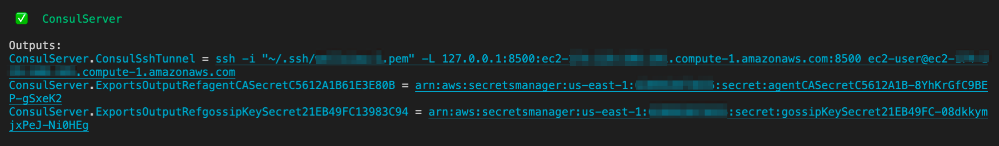

# Example CDK implementation - Amazon ECS on AWS Fargate with Consul Connect service mesh

In this example we'll configure one Consul server in VPC with TLS and gossip encryption enabled. Using [AWS CDK ECS service extension for Consul](https://github.com/aws-ia/ecs-consul-mesh-extension), this sample app will will launch ECS cluster with sample `greeter` application connected to Consul service mesh.

## Pre-requisites:
* AWS CLI with valid AWS account credentials configured.
* The AWS CDK uses Node.js (>= 10.13.0, except for versions 13.0.0 - 13.6.0). A version in active long-term support (14.x at this writing) is recommended.
* We highly recommend to use an IDE that supports code-completion and syntax highlighting, i.e. VSCode, AWS Cloud9, Atom, etc.
* AWS CDK Toolkit, you can install it via: `npm install -g aws-cdk`

## Step 1: Create the project directory
First create an empty directory on your system, initialize Typescript CDK project and install NPM packages. Replace `$ACCOUNT` and `$REGION` with your target AWS account id and region accordingly.

```
mkdir app && cd app
cdk init app --language typescript
cdk bootstrap aws://$ACCOUNT/$REGION

npm install @aws-cdk/core @aws-cdk/aws-ec2 @aws-cdk/aws-ecs @aws-cdk/aws-iam @aws-cdk/aws-secretsmanager @aws-cdk-containers/ecs-service-extensions @aws-quickstart/ecs-consul-mesh-extension
npm update
```

## Step 2: Define shared properties

We are going to create and deploy the three separate stack for environment (VPC and ECS cluster), Consul server and microservices application stack.

First we need to declare shared properties between the stacks. Create a new `lib/shared-props.ts` file with the following content.

```ts
import * as cdk from '@aws-cdk/core';
import * as ec2 from '@aws-cdk/aws-ec2';
import * as extensions from '@aws-cdk-containers/ecs-service-extensions';
import * as secretsmanager from '@aws-cdk/aws-secretsmanager';

export interface EnvironmentInputProps extends cdk.StackProps {
  envName: string;
  allowedIpCidr: string;
}

export interface EnvironmentOutputProps extends cdk.StackProps {
  envName: string;
  vpc: ec2.Vpc;
  serverSecurityGroup: ec2.SecurityGroup;
  clientSecurityGroup: ec2.SecurityGroup;
  ecsEnvironment: extensions.Environment;
}

export interface ServerInputProps extends cdk.StackProps {
  envProps: EnvironmentOutputProps,
  keyName: string,
}

export interface ServerOutputProps extends cdk.StackProps {
  serverTag: {[key: string]: string};
  serverDataCenter: string;
  agentCASecret: secretsmanager.ISecret;
  gossipKeySecret: secretsmanager.ISecret;
}
```

## Step 3: Create the environment

Now we are going to build a new VPC, launch ECS cluster and create dedicated security group for Consul server and client. Create a new file `lib/environment.ts` with the following content. 

```ts
import * as cdk from '@aws-cdk/core';
import * as ec2 from '@aws-cdk/aws-ec2';
import * as ecs from '@aws-cdk/aws-ecs';
import * as extensions from '@aws-cdk-containers/ecs-service-extensions';
import { EnvironmentInputProps, EnvironmentOutputProps } from './shared-props';

export class Environment extends cdk.Stack {
  public readonly props: EnvironmentOutputProps;

  constructor(scope: cdk.Construct, id: string, inputProps: EnvironmentInputProps) {
    super(scope, id, inputProps);

    const vpc = new ec2.Vpc(this, 'ConsulVPC', {
      subnetConfiguration: [{
          name: 'PublicSubnet',
          subnetType: ec2.SubnetType.PUBLIC,
        }]
    });

    const serverSecurityGroup = new ec2.SecurityGroup(this, 'ConsulServerSecurityGroup', {
      vpc,
      description: 'Access to the ECS hosts that run containers',
    });

    serverSecurityGroup.addIngressRule(
      ec2.Peer.ipv4(inputProps.allowedIpCidr),
      ec2.Port.tcp(22),
      'Allow incoming connections for SSH over IPv4');

    const clientSecurityGroup = new ec2.SecurityGroup(this, 'ConsulClientSecurityGroup', {
      vpc,
    });

    clientSecurityGroup.addIngressRule(
      clientSecurityGroup,
      ec2.Port.tcp(8301),
      'allow all the clients in the mesh talk to each other'
    );
    
    clientSecurityGroup.addIngressRule(
      clientSecurityGroup,
      ec2.Port.udp(8301),
      'allow all the clients in the mesh talk to each other'
    );

    const ecsCluster = new ecs.Cluster(this, 'ConsulMicroservicesCluster', {
      vpc: vpc,
    });

    const ecsEnvironment = new extensions.Environment(scope, 'ConsulECSEnvironment', {
      vpc,
      cluster: ecsCluster,
    });

    this.props = {
      envName: inputProps.envName,
      vpc,
      serverSecurityGroup,
      clientSecurityGroup,
      ecsEnvironment,
    };
  }
}
```

## Step 4: Create the Consul Server
Next we're going to create the Consul server stack. This stack will automatically configure Consul with TLS and gossip encryption. There will be two AWS Secrets Manager secrets created after successful deployment. 

###  Consul Server bootstrap

To automatically configure Consul server with TLS and gossip encryption, we going to bootstrap it during launch. Create file `lib/user-data.txt` with the following content.

```bash
#Utillity
sudo yum install jq unzip wget docker -y
usermod -a -G docker ec2-user
sudo service docker start
curl "https://awscli.amazonaws.com/awscli-exe-linux-x86_64.zip" -o "awscliv2.zip"
unzip awscliv2.zip
sudo ./aws/install
wget https://releases.hashicorp.com/consul/1.10.4/consul_1.10.4_linux_amd64.zip
unzip consul_1.10.4_linux_amd64.zip

EC2_INSTANCE_IP_ADDRESS=$(curl -s 169.254.169.254/latest/meta-data/local-ipv4)
EC2_INSTANCE_ID=$(curl -s 169.254.169.254/latest/meta-data/instance-id)
AWS_REGION=$(curl -s 169.254.169.254/latest/dynamic/instance-identity/document | jq -r '.region')

mkdir -p /opt/consul/data
mkdir -p /opt/consul/config

#Consul initial setup
cat << EOF > /opt/consul/config/consul-server.json
{
  "advertise_addr": "${EC2_INSTANCE_IP_ADDRESS}",
  "client_addr": "0.0.0.0",
  "connect": {
    "enabled": true
  }
}
EOF

docker run -d --net=host -p 8300:8300 -p 8301:8301 -p 8301:8301/udp -p 8302:8302 \
  -p 8302:8302/udp -p 8400:8400 -p 8500:8500 -p 53:53/udp \
  -v /opt/consul/data:/consul/data -v /opt/consul/config:/consul/config \
  -v /var/run/docker.sock:/var/run/docker.sock \
  -h $EC2_INSTANCE_ID --name consul-server -e CONSUL_ALLOW_PRIVILEGED_PORTS=1 \
  -l service_name=consul-server public.ecr.aws/hashicorp/consul:1.10.4 agent -server \
  -bootstrap-expect 1 -ui -config-file /consul/config/consul-server.json

#Generate Consul CA
./consul tls ca create
aws secretsmanager update-secret --secret-id $CONSUL_CA_SECRET_ARN \
--secret-string file://consul-agent-ca.pem \
--region $AWS_REGION

#Generate Server certs
./consul tls cert create -server -dc dc1
sudo mkdir /opt/consul/certs
sudo cp consul-agent-ca.pem /opt/consul/certs
sudo cp dc1-server-consul-0-key.pem /opt/consul/certs
sudo cp dc1-server-consul-0.pem /opt/consul/certs
sudo tee /opt/consul/config/tls.json > /dev/null << EOF
{
    "ports": {"https": 8501},
    "verify_incoming_rpc": true,
    "verify_outgoing": true,
    "verify_server_hostname": true,
    "ca_file": "/consul/certs/consul-agent-ca.pem",
    "cert_file": "/consul/certs/dc1-server-consul-0.pem",
    "key_file": "/consul/certs/dc1-server-consul-0-key.pem",
    "auto_encrypt": { "allow_tls": true }
}
EOF

#Generate gossip
./consul keygen > consul-agent-gossip.txt
aws secretsmanager update-secret --secret-id $CONSUL_GOSSIP_SECRET_ARN \
--secret-string file://consul-agent-gossip.txt \
--region $AWS_REGION

GOSSIP_SECRET=$(cat consul-agent-gossip.txt)
sudo tee /opt/consul/config/consul-server.json > /dev/null << EOF
{
  "advertise_addr": "$EC2_INSTANCE_IP_ADDRESS",
  "client_addr": "0.0.0.0",
  "connect": {
    "enabled": true
  },
  "encrypt": "$GOSSIP_SECRET"
}
EOF

#Restart Consul
docker stop consul-server
docker rm consul-server
EC2_INSTANCE_ID=$(curl -s http://169.254.169.254/latest/meta-data/instance-id)
docker run -d --net=host -p 8300:8300 -p 8301:8301 -p 8301:8301/udp -p 8302:8302 \
-p 8302:8302/udp -p 8400:8400 -p 8500:8500 -p 53:53/udp \
-v /opt/consul/data:/consul/data \
-v /opt/consul/config:/consul/config \
-v /opt/consul/certs:/consul/certs \
-v /var/run/docker.sock:/var/run/docker.sock \
-h $EC2_INSTANCE_ID --name consul-server -e CONSUL_ALLOW_PRIVILEGED_PORTS=1 \
-l service_name=consul-server public.ecr.aws/hashicorp/consul:1.10.4 agent -server \
-bootstrap-expect 1 -ui -config-file /consul/config/consul-server.json
```

###  Consul Server setup

Create file `lib/consul-server.ts` with the following content. We are using the default Consul data center value = dc1. Change the variable `serverDataCenter` accordingly if you are using different Consul data center.

```ts
import * as fs from 'fs';
import * as cdk from '@aws-cdk/core';
import * as ec2 from '@aws-cdk/aws-ec2';
import * as iam from '@aws-cdk/aws-iam';
import * as secretsmanager from '@aws-cdk/aws-secretsmanager';
import { ServerInputProps, ServerOutputProps } from './shared-props';

export class ConsulServer extends cdk.Stack {
  public readonly props: ServerOutputProps;

  constructor(scope: cdk.Construct, id: string, inputProps: ServerInputProps) {
    super(scope, id, inputProps);

    const ami = new ec2.AmazonLinuxImage({
      generation: ec2.AmazonLinuxGeneration.AMAZON_LINUX_2,
    });

    const agentCASecret = new secretsmanager.Secret(this, 'agentCASecret', {
      description: 'Consul TLS encryption CA public key'
    });

    const gossipKeySecret = new secretsmanager.Secret(this, 'gossipKeySecret', {
      description: 'Consul gossip encryption key'
    });

    // Role to allow Consul server to write to secrets manager
    const role = new iam.Role(this, 'ConsulSecretManagerRole', {
      assumedBy: new iam.ServicePrincipal('ec2.amazonaws.com'),
    });
    role.addToPolicy(new iam.PolicyStatement({
      actions: ['secretsmanager:UpdateSecret'],
      resources: [agentCASecret.secretArn, gossipKeySecret.secretArn],
    }));

    const userData = ec2.UserData.forLinux();
    const userDataScript = fs.readFileSync('./lib/user-data.txt', 'utf8');
    const consulInstanceName = 'ConsulInstance';

    userData.addCommands('export CONSUL_CA_SECRET_ARN='+ agentCASecret.secretArn)
    userData.addCommands('export CONSUL_GOSSIP_SECRET_ARN='+ gossipKeySecret.secretArn)
    userData.addCommands(userDataScript);
    userData.addCommands(
    `# Notify CloudFormation that the instance is up and ready`,
    `yum install -y aws-cfn-bootstrap`,
    `/opt/aws/bin/cfn-signal -e $? --stack ${cdk.Stack.of(this).stackName} --resource ${consulInstanceName} --region ${cdk.Stack.of(this).region}`);

    const vpc = inputProps.envProps.vpc;

    // This setup is just for a test environment
    const consulServer = new ec2.Instance(this, consulInstanceName, {
      vpc: vpc,
      securityGroup: inputProps.envProps.serverSecurityGroup,
      instanceType: ec2.InstanceType.of(ec2.InstanceClass.T3,ec2.InstanceSize.LARGE),
      machineImage: ami,
      keyName: inputProps.keyName,
      role: role,
      userData: userData,
      resourceSignalTimeout: cdk.Duration.minutes(5)
    });
    var cfnInstance = consulServer.node.defaultChild as ec2.CfnInstance
    cfnInstance.overrideLogicalId(consulInstanceName);

    const serverDataCenter = 'dc1';
    const tagName = 'Name'
    const tagValue = inputProps.envProps.envName + '-consul-server';
    cdk.Tags.of(consulServer).add(tagName, tagValue);
    const serverTag = { [tagName]: tagValue };

    new cdk.CfnOutput(this, 'ConsulSshTunnel', {
      value: `ssh -i "~/.ssh/`+ inputProps.keyName + `.pem" ` +
       `-L 127.0.0.1:8500:` + consulServer.instancePublicDnsName + `:8500 ` +
       `ec2-user@` + consulServer.instancePublicDnsName,
      description: 'Command to run to open a local SSH tunnel to view the Consul dashboard',
    });

    this.props = {
      serverTag,
      serverDataCenter,
      agentCASecret,
      gossipKeySecret
    };
  }
}
```

## Step 4: Build sample Microservices app with Consul Clients

Now we set up three microservices to join Consul service mesh. `greeter` service acts as the front-end that communicate with `name` and `greeting` service. Create a new file `lib/microservices.ts` with the following content. 

```ts
import * as path from 'path';
import * as cdk from '@aws-cdk/core';
import * as ec2 from '@aws-cdk/aws-ec2';
import * as ecs from '@aws-cdk/aws-ecs';
import * as consul_ecs from '@aws-quickstart/ecs-consul-mesh-extension';
import * as ecs_extensions from '@aws-cdk-containers/ecs-service-extensions';
import { EnvironmentOutputProps, ServerOutputProps } from './shared-props';

export class Microservices extends cdk.Stack {
  constructor(scope: cdk.Construct, id: string,
    envProps:EnvironmentOutputProps, serverProps: ServerOutputProps, props?: cdk.StackProps) {
      super(scope, id, props);

      const consulServerSecurityGroup = ec2.SecurityGroup.fromSecurityGroupId(this, 'ImportedServerSG', envProps.serverSecurityGroup.securityGroupId);
      const consulClientSecurityGroup = ec2.SecurityGroup.fromSecurityGroupId(this, 'ImportedClientSG', envProps.clientSecurityGroup.securityGroupId);

      // Consul Client Base Configuration
      const retryJoin = new consul_ecs.RetryJoin({
        region: cdk.Stack.of(this).region,
        tagName: Object.keys(serverProps.serverTag)[0],
        tagValue: Object.values(serverProps.serverTag)[0]});
      const baseProps = {
        retryJoin,
        consulClientSecurityGroup: consulClientSecurityGroup,
        consulServerSecurityGroup: consulServerSecurityGroup,
        consulCACert: serverProps.agentCASecret,
        gossipEncryptKey: serverProps.gossipKeySecret,
        tls: true,
        consulDatacenter: serverProps.serverDataCenter,
      };

      // NAME service
      const nameDescription = new ecs_extensions.ServiceDescription();
      nameDescription.add(new ecs_extensions.Container({
        cpu: 512,
        memoryMiB: 1024,
        trafficPort: 3000,
        image: ecs.ContainerImage.fromRegistry('nathanpeck/name')
      }));
      nameDescription.add(new consul_ecs.ECSConsulMeshExtension({
        ...baseProps,
        serviceDiscoveryName: 'name',
      }));
      nameDescription.add(new ecs_extensions.AssignPublicIpExtension());
      const name = new ecs_extensions.Service(this, 'name', {
        environment: envProps.ecsEnvironment,
        serviceDescription: nameDescription
      });

      // GREETING service
      const greetingDescription = new ecs_extensions.ServiceDescription();
      greetingDescription.add(new ecs_extensions.Container({
        cpu: 512,
        memoryMiB: 1024,
        trafficPort: 3000,
        image: ecs.ContainerImage.fromRegistry('nathanpeck/greeting')
      }));
      greetingDescription.add(new consul_ecs.ECSConsulMeshExtension({
        ...baseProps,
        serviceDiscoveryName: 'greeting',
      }));
      greetingDescription.add(new ecs_extensions.AssignPublicIpExtension());
      const greeting = new ecs_extensions.Service(this, 'greeting', {
        environment: envProps.ecsEnvironment,
        serviceDescription: greetingDescription,
      });

      // GREETER service
      const greeterDescription = new ecs_extensions.ServiceDescription();
      greeterDescription.add(new ecs_extensions.Container({
        cpu: 512,
        memoryMiB: 1024,
        trafficPort: 3000,
        image: ecs.ContainerImage.fromRegistry('nathanpeck/greeter')
      }));
      greeterDescription.add(new consul_ecs.ECSConsulMeshExtension({
        ...baseProps,
        serviceDiscoveryName: 'greeter',
      }));
      greeterDescription.add(new ecs_extensions.AssignPublicIpExtension());
      greeterDescription.add(new ecs_extensions.HttpLoadBalancerExtension());
      const greeter = new ecs_extensions.Service(this, 'greeter', {
        environment: envProps.ecsEnvironment,
        serviceDescription: greeterDescription,
      });

      // CONSUL CONNECT
      greeter.connectTo(name, { local_bind_port: 3001 });
      greeter.connectTo(greeting, { local_bind_port: 3002 });

      new cdk.CfnOutput(this, 'ConsulClientSG', {
        value: envProps.clientSecurityGroup.securityGroupId,
        description: "Consul Client SG",
      });
  }
}
```

## Step 5: Deploy the application

### Modify app entry point 

Modify the app entry point to launch all stacks. Open `bin/app.ts` file and replace it with the content below. 

```ts
#!/usr/bin/env node
import 'source-map-support/register';
import * as cdk from '@aws-cdk/core';

const app = new cdk.App();

import { Environment } from '../lib/environment';

// Environment
var allowedIPCidr = process.env.ALLOWED_IP_CIDR || `$ALLOWED_IP_CIDR`;
const environment = new Environment(app, 'ConsulEnvironment', {
    envName: 'test',
    allowedIpCidr: allowedIPCidr,
});

import { ConsulServer } from '../lib/consul-server';

// Consul Server
var keyName = process.env.MY_KEY_NAME || `$MY_KEY_NAME`;
const server = new ConsulServer(app, 'ConsulServer', {
    envProps: environment.props,
    keyName,
});

import { Microservices } from '../lib/microservices';

// Microservices with Consul Client
const microservices = new Microservices(app, 'ConsulMicroservices', environment.props, server.props);

```

### Deploy the app

You need to supply two parameters to the stack: your public IP and your EC2 key pair. 
- Set the environment variable `$ALLOWED_IP_CIDR` with your own public IP address (include the /32 suffix). 
- Set environment variable `$MY_KEY_NAME` with your existing EC2 key-pair name. 

Refer to example below:
```bash
export ALLOWED_IP_CIDR=$(curl -s ifconfig.me)/32
export MY_KEY_NAME=<CHANGE WITH YOUR EC2 KEY PAIR>
cdk deploy --all
```

Use the CDK output value `ConsulSshTunnel` to establish reverse tunnel to the Consul server. Access Consul UI from http://localhost:8500/ui



Get the ELB URL from the output and open it on your browser to check the result.


Congrats, you have successfully deployed sample microservice app in ECS and join it to Consul service mesh running on EC2. Don't forget to complete the clean up steps to avoid any incurring charges.

## Step 6: Clean up

From your terminal, destroy all stacks

```
cdk destroy --all
```

## Reference

* In hurry? see the full example [here](app/)
* Check the [ECS Consul Mesh CDK repo](https://github.com/aws-ia/ecs-consul-mesh-extension)